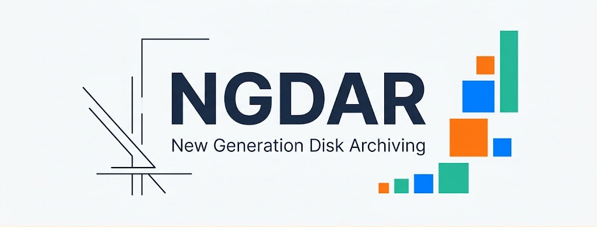

<div align="center">



**Git-like incremental archiving for massive binary files on optical media**

[](https://github.com/XavierTolza/ngdar/actions/workflows/ci.yml)
[](https://www.rust-lang.org)
[](https://opensource.org/licenses/MIT)

</div>

---

**NGDAR** lets you archive large files onto optical discs (DVD, Blu-ray) or LTO tapes the same way you manage code with Git.

Each `.tar` archive it produces contains the **complete history** of your data plus **only the files that changed** since the last session. No more burning everything from scratch every time — a quick look at the plain-text metadata tells you exactly which volume holds which file.

> **Typical use case**: you have 50 GB of photos, videos, or documents to back up across 4.7 GB DVDs. NGDAR splits the work into incremental sessions, and each DVD carries the new files **plus** the full index of everything you've ever archived.

---

## ✨ Features

- **Incremental archiving** — Only new or changed files go into each archive
- **Commit/pack split** — Record a snapshot with `commit`, then build TAR archives on demand for any commit (by hash, prefix, or volume ID) or any commit range
- **Plain-text metadata** — No proprietary database. A simple `cat` is all you need to read the entire history
- **No vendor lock-in** — Your data never depends on a closed format or a specific tool
- **Content-addressable storage** — Every file is identified by its BLAKE3 hash (automatic deduplication)
- **Free-form volume IDs** — Name your volumes however you like (`DVD-001`, `LTO-2026-08`, …)
- **OS-level cache** — Hashes cached in `~/.cache/ngdar/` for near-instant subsequent runs
- **`.ngdarignore`** — Exclude temp files, logs, and other artifacts
- **Standard `.tar` output** — Archives can be extracted with any tar-compatible tool
- **CSV export** — Dump your entire metadata database for inventory purposes

---

## 🚀 Installation

### Prerequisites

- [Rust](https://www.rust-lang.org) 1.70 or newer
- Linux, macOS (or Windows with a Unix environment)

### From source

```bash
git clone https://github.com/XavierTolza/ngdar.git
cd ngdar

cargo build --release
cp target/release/ngdar ~/.local/bin/    # or anywhere in your PATH

ngdar --version
```

### Via `cargo install`

```bash
cargo install --git https://github.com/XavierTolza/ngdar.git
```

### Via Docker

Prebuilt images are published to [GHCR](https://ghcr.io) under
`ghcr.io/xaviertolza/ngdar` for `linux/amd64` and `linux/arm64`
(`latest` tracks `master`, `vX.Y.Z` tags track releases).

```bash
# Run in the directory you want to archive (mount it into the container):
docker run --rm -v "$PWD:/work" ghcr.io/xaviertolza/ngdar init
docker run --rm -v "$PWD:/work" ghcr.io/xaviertolza/ngdar add mydata/
docker run --rm -v "$PWD:/work" ghcr.io/xaviertolza/ngdar commit --vol-id "DVD-001" -m "First archival session"
```

The image contains only the fully static `ngdar` binary (no base OS), just
like the standalone Linux build. Local images are built with:

```bash
docker build -t ngdar .
```

---

## 📖 Step-by-step guide

### 1. Initialize a repository

```bash
cd /path/to/my/data/
ngdar init
```

A hidden `.ngdar/` directory is created. It will hold all metadata (never the binary files themselves).

### 2. Add files

```bash
ngdar add photos/ videos/ documents/
ngdar add final-report.pdf
```

NGDAR computes the BLAKE3 hash of each file and adds it to the staging area (the index). Files that are already archived unchanged are detected and skipped.

### 3. Check status

```bash
ngdar status
```

Three categories are shown:

| State | Description |
|---|---|
| ✅ **Staged** | Ready to be committed |
| 🔶 **Unstaged** | Modified on disk but not re-staged |
| ❓ **Untracked** | New file not yet tracked |

### 4. Record a commit

```bash
ngdar commit --vol-id "DVD-001" -m "First archival session"
```

This command:
1. Creates **Meta** objects (size, date, permissions, hash, volume ID)
2. Builds **Tree** and **Commit** objects
3. Updates `HEAD` and clears the staging index (ready for the next session)

It does **not** produce any archive — committing is cheap and only records
the snapshot. Packaging is a separate step so you can burn archives only when
you actually need to.

### 5. Build an archive for a commit

```bash
ngdar pack <commit> --out archive_001.tar
```

`pack` takes a commit identifier — a full hash, a unique hash prefix, **or
the volume ID** used at commit time — and produces a `.tar` containing:

- The complete `.ngdar/` directory — **full history**
- The files associated with that commit, in their original directory tree

You can also pack a range `<from>..<to>` to bundle every file that changed
between two commits:

```bash
ngdar pack a1b2c3d..f6e5d4c --out changes.tar
```

Before writing the archive, NGDAR prints the **total size** of the files
about to be added, then shows a **progress bar** while the files are written
to the TAR. Pass `--verbose` (`-v`) to also print each file as it is added:

```bash
ngdar pack DVD-001 --out archive_001.tar --verbose

Packing commit 3f7c871e...
Total size: 8.4 GB
   adding: photos/vacation.jpg (4.2 MB)
   adding: videos/birthday.mp4 (1.1 GB)
   ...
```

### 6. Second session

```bash
ngdar add new-photos/
ngdar commit --vol-id "DVD-002" -m "New photos"
ngdar pack DVD-001..DVD-002 --out archive_002.tar
```

DVD-002 contains only the new photos, **but** the `.ngdar/` inside the archive also references every file from DVD-001. From any single archive you can tell exactly where every file lives.

### 7. Browse history

```bash
# List all commits
ngdar log

# Inspect a specific commit
ngdar log a1b2c3d4e5f6...
```

---

## 🏗️ Architecture

### Core principles

1. **Content-addressable storage** — Every file is identified by its BLAKE3 hash. The hash is computed once and cached in `~/.cache/ngdar/<repo-id>/cache.tsv`.

2. **Plain-text metadata** — All history (commits, trees, file metadata) is stored as readable text files named by their own BLAKE3 hash. No database, no proprietary format.

3. **Self-contained archives** — Each `.tar` archive carries the **complete** metadata history plus **only** the binary files changed in that session. This makes it easy to keep track of which disk each file was stored on: any single archive is enough to know exactly where every file lives.

### Repository structure

```
.ngdar/                    # Local metadata (no binary duplication)
├── repository_id          # UUID v4 linking the project to its OS cache
├── HEAD                   # Pointer to the latest commit hash
├── index                  # Staging area (files ready for the next commit)
├── committed              # List of already-archived files (hash + path)
└── objects/               # Content-addressed object store
    ├── ab/                # First 2 hash chars = directory
    │   └── cd...          # Meta, Tree, or Commit object
    └── ...
```

### Archive format

```
archive_001.tar
├── .ngdar/                # Full metadata (complete history)
│   ├── repository_id
│   ├── HEAD
│   ├── index
│   ├── committed
│   └── objects/
│       └── ...
├── photos/                # Binary files (incremental — this session only)
│   └── beach.jpg
└── videos/
    └── birthday.mp4
```

### Object model (all plain text)

**Meta** (a single file)
```
type meta
size 4718592
mtime 1788118000
permissions 644
binary_hash a1b2c3d4e5f6...
volume_id DVD-001
path photos/vacation.jpg
```

**Tree** (a directory)
```
meta 81a44c7...  document.pdf
tree e3b0c44...  subfolder
```

**Commit** (a snapshot)
```
tree a1b2c3d...
parent f6e5d4c...
author user <user@host> 1788118091
os Linux 6.6.0-x86_64
tool_version ngdar-1.0.0

Added vacation photos
```

---

## 📋 Command reference

| Command | Description |
|---|---|
| `ngdar init` | Initialize a repository in the current directory |
| `ngdar add <paths>` | Stage files for the next commit |
| `ngdar status` | Show staged, unstaged, and untracked files |
| `ngdar commit --vol-id <ID> -m <msg>` | Record staged files as a commit (no archive) |
| `ngdar pack <target> --out <archive> [-v]` | Create a TAR archive for a commit, volume ID, or `from..to` range (progress bar; `-v` lists each file) |
| `ngdar log [hash]` | List commits or show files in a commit |
| `ngdar remove-commit <hash\|HEAD>` | Remove a commit from the history chain |
| `ngdar hash <file>` | Compute and print a file's BLAKE3 hash |
| `ngdar export <hash> --out <archive>` | Rebuild an archive from stored metadata |
| `ngdar db-export <file.csv>` | Export all metadata to CSV |

---

## ⚙️ Configuration

### `.ngdarignore`

Place a `.ngdarignore` file at the repository root using the same syntax as `.gitignore`:

```
*.log
tmp/
cache/
```

### System cache

The cache lives at `~/.cache/ngdar/<repo-id>/cache.tsv` (TSV format: `size\ttimestamp\thash\tpath`). If the OS purges the cache, NGDAR transparently recomputes hashes.

---

## 🛠️ Development

### Build & test

```bash
# Optimized build
cargo build --release

# Run all tests
cargo test

# Formatting and lint (same as CI)
cargo fmt --check
cargo clippy -- -D warnings

# Generate documentation
RUSTDOCFLAGS="-D warnings" cargo doc --document-private-items
```

### Pre-commit hooks

```bash
pre-commit install
```

Hooks check formatting, forbid certain patterns, and run the full CI suite before pushing.

---

## 🚀 Releasing

Releases are fully automated from the GitHub web UI — no local steps.

1. Go to the **Actions** tab → **Release** → **Run workflow**.
2. Enter the version (e.g. `1.2.0`) and the branch to release from (default: `develop`).
3. Click **Run workflow**. The pipeline then:
   - opens a `Release v1.2.0` pull request that merges the source branch into `master`,
   - runs the full CI on that release branch,
   - merges it into `master` (only if CI passed),
   - tags `master` with `v1.2.0`,
   - builds and publishes a GitHub Release with cross-platform binaries
     (Linux gnu/musl on x86_64/aarch64/armv7, macOS Intel/Apple Silicon,
     Windows) plus `.deb` and `.rpm` packages,
   - builds and pushes the Docker image (`linux/amd64` + `linux/arm64`)
     to GHCR under `ghcr.io/xaviertolza/ngdar`.

Versions ending in a pre-release suffix (e.g. `1.2.0-rc.1`) are published as
GitHub pre-releases automatically.

---

## 🤝 Contributing

Contributions are welcome! Here's how:

1. **Fork** the project
2. Create a branch: `git checkout -b my-feature`
3. **Commit** your changes
4. **Push**: `git push origin my-feature`
5. Open a **Pull Request** against `master`

Please keep these practices in mind:
- Keep PRs short and focused (one responsibility per PR)
- Use clear, conventional commit messages
- Include tests for every new feature

---

## 📄 License

Distributed under the **MIT** license. See the `LICENSE` file for details.
